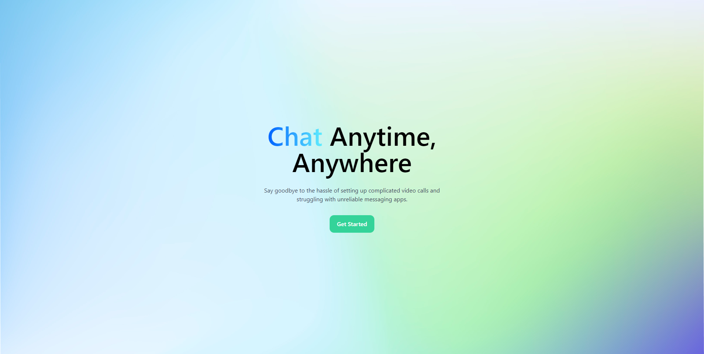

   
   
   
   
  
   
   
   
   

# QuickChat

Quickchat is a chat application that allows users to connect and communicate in real-time. With Quickchat, users can easily create accounts, find and add friends, and start conversations with individuals or groups. Quickchat is designed to be fast, simple, and intuitive, with a clean and modern interface that makes it easy to use

Project is live on [quick-chat.app](https://quick-chat.app/)

## Documents

Design Documentations can be found [here](./documentations).

## Screenshots

  
   
   
  
   
   
  
   
   
  
   
   

## Features

- Avatar
- Rate Limiter
- User authentication
- Real-time messaging
- Direct messaging
- Group Chats
- Audio and video calls
- Screen sharing
- View message history and retrieve messages using pagination
- Friends list
- Friend Requests
- Online indicators
- Group Chat All Participants info
- Emojis support
- Multi-device compatibility
- Responsive Layout

## Improvement

- Support file sharing.
- Allowing users to upload their avatar
- Voice messages
- Rich Text Sending
- Chatbot intergrations
